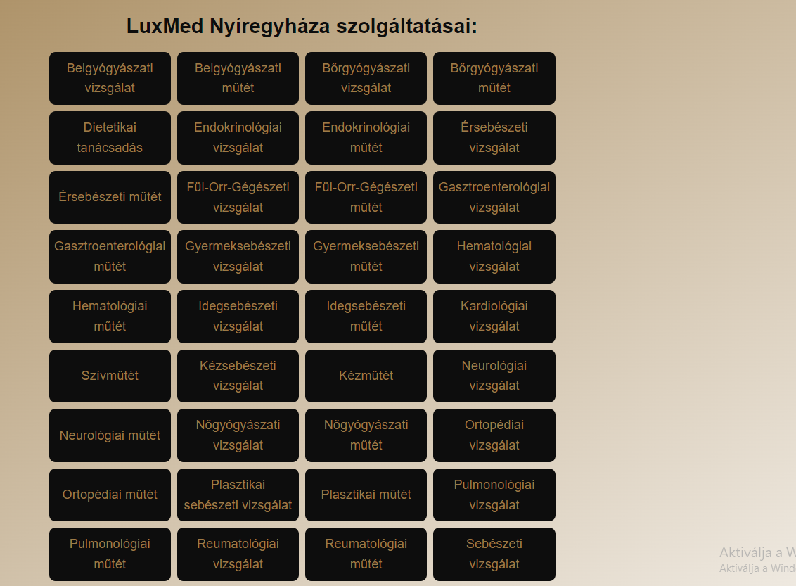

= Időpontok kezelése - Funkcionális modell

== Leírás
A látogató tudjon időpontot foglalni az időpontfoglaló komponens használatával.

Az adminisztrátor tudjon időpontot foglalni, listázni, megtekinteni és törölni az admin felületen keresztül.

== Használati esetek

=== Használati eset diagram

=== Használati esetek rövid leírása

==== Időpontok listázása

[cols="1h,3"]
|===
| Azonosító
| UC_I_List

| Kiváltó esemény
| Az adminisztrátor (bejelentkezett felhasználó) listázni kívánja az időpontokat

| Felhasználók
| Adminisztrátor

| Elsődleges lefutás
|
1. Az adminisztrátor az admin felületen az Időpontok kezelése gombra kattint

2. A rendszerben kiválogatásra kerülnek az időpontok

| Kivételek és alternatívák
| -

| Utófeltétel
| A rendszerben az időpontok listája előállt

| Eredmény
| Az adminisztrátor látja az időpontok listáját, kiválaszthat egyet közülük.

| Használati eset realizáció
| Technikai modell

|===

==== Időpont megtekintése

[cols="1h,3"]
|===
| Azonosító
| UC_I_Read

| Kiváltó esemény
| Az adminisztrátor (bejelentkezett felhasználó) meg kívánja tekinteni a kiválasztott időpont metaadatait

| Felhasználók
| Adminisztrátor

| Elsődleges lefutás
|
1. Az adminisztrátor az admin felületen az időpontok listájából kiválasztja a megtekinteni kívánt időpontot

2. A rendszerben lekérdezésre kerül a kiválasztott időpont

| Kivételek és alternatívák
| -

| Utófeltétel
| A rendszerben az időpont lekérdezésre került

| Eredmény
| Az adminisztrátor látja a kiválasztott időpont metaadatait

| Használati eset realizáció
| Technikai modell

|===

==== Időpont foglalása

[cols="1h,3"]
|===
| Azonosító
| UC_I_Create

| Kiváltó esemény
| A látogató új időpontot kíván foglalni a rendszerben

| Felhasználók
| Látogató, Adminisztrátor

| Elsődleges lefutás
|
1. A látogató az Időpontfoglalás gombra kattintva megkezdi az időpontfoglalás folyamatát

2. A látogató az egyes menüpontokon
(Kórház kiválasztása, Szolgáltatás kiválasztása, Orvos kiválasztása, Dátum és időpont kiválasztása, Adatok megadása)
lépésről lépésre végiglépkedve megadja az időpontfoglaláshoz szükséges adatokat

3. A rendszerben rögzítésre kerül az újonnan foglalt időpont

| Kivételek és alternatívák
| -

| Utófeltétel
| A rendszerben az időpont rögzítésre került

| Eredmény
| A látogató és az adminisztrátor számára az imént rögzített időpont elérhető a rendszerben.
Erre az időpontra NEM lehet másik vizsgálatot foglalni.

| Használati eset realizáció
| Technikai modell

|===

==== Időpont törlése

[cols="1h,3"]
|===
| Azonosító
| UC_I_Delete

| Kiváltó esemény
| Az adminisztrátor (bejelentkezett felhasználó) törölni kívánja a kiválasztott időpontot a rendszerből

| Felhasználók
| Adminisztrátor

| Elsődleges lefutás
|
1. Az adminisztrátor az admin felületen az Időpontok kezelése menüpontra kattint

2. Az adminisztrátor az Időpontok kezelése felületen kiválasztja a törölni kívánt időpontot

3. A felugró ablak törlés gombjára kattintva a felhasználó megerősíti a törlési szándékát

4. A rendszerben törlésre kerül a kiválasztott időpont

| Kivételek és alternatívák
| -

| Utófeltétel
| A rendszerben a kiválasztott időpont törlésre került

| Eredmény
| A látogató és az adminisztrátor a továbbiakban nem látja a törölt időpont metaadatait.
Erre az időpontra ismét lehetséges az időpontfoglalás.

| Használati eset realizáció
| Technikai modell

|===

== Jogosultságok

[cols="1,1,1"]
|===
| Használati eset | Jogosultság | Szerepkörök

| Időpontok listázása
| LIST_IDOPONT
| Adminisztrátor

| Időpont megtekintése
| GET_IDOPONT
| Adminisztrátor

| Időpont törlése
| DELETE_IDOPONT
| Adminisztrátor

|===

== Felületi terv

=== Időpontok listázása felület

==== Arculat

==== A felületen lévő mezők

[cols="1,1,1,1,1"]

|===
| Név | Típus | Kötelező? | Szerkeszthető? | Megjelenés

| Foglaló neve
| Címke
| I
| N
| Találati lista ablakrész

| Foglaló telefonszáma
| Címke
| I
| N
| Találati lista ablakrész

| Foglaló e-mail címe
| Címke
| I
| N
| Találati lista ablakrész

| Idő
| Címke
| I
| N
| Találati lista ablakrész

|===

==== A felületről elérhető műveletek

[cols="1,1,1"]
|===
| Esemény | Leírás | Jogosultság

| Kiválasztott időpontra kattintás
| Végrehajtásra kerül az Időpont megtekintése használati eset.
  Az adminisztrátor az Időpont megtekintése/törlése felületre jut.
| LIST_IDOPONT, GET_IDOPONT

|===

=== Időpont megtekintése/törlése felület

==== Arculat

==== A felületen lévő mezők

[cols="1,1,1,1"]

|===
| Név | Típus | Kötelező? | Szerkeszthető?

| Név
| Címke
| I
| N

| Telefonszám
| Címke
| I
| N

| Név
| Címke
| I
| N

| Email
| Címke
| I
| N

| Orvos neve
| Címke
| I
| N

| Kórház neve
| Címke
| I
| N

| Szolgáltatás neve
| Címke
| I
| N

|===

==== A felületről elérhető műveletek

[cols="1,1,1"]
|===
| Esemény | Leírás | Jogosultság

| Bezárás gombra kattintás
| Bezáródik az Időpont megtekintése/törlése felület. Az adminisztrátor az Időpontok kezelése felületre jut.
| -

| Törlés gombra kattintás
| Végrehajtásra kerül az Időpont törlése használati eset. Az adminisztrátor az Időpontok kezelése felületre jut.
| DELETE_IDOPONT

|===

=== Időpont foglalása felület

==== Arculat

Kórház kiválasztása:

Szolgáltatás kiválasztása:

Orvos kiválasztása:

image::../static/screenshots/idopont_foglalasa_3.png[Orvos kiválasztása]

Dátum és idő kiválasztása:

Adatok megadása:

Sikeres foglalás:

==== A felületen lévő mezők

[cols="1,1,1,1,1"]

|===
| Név | Típus | Kötelező? | Szerkeszthető? | Megjelenés

| Kórházak
| Címkék (lista)
| I
| N
| Kórház kiválasztása felületrész

| Szolgáltatások
| Címkék (lista)
| I
| N
| Szolgáltatás kiválasztása felületrész

| Orvosok
| Címkék (lista)
| I
| N
| Orvos kiválasztása felületrész

| Dátum
| Naptár
| I
| N
| Dátum és idő kiválasztása felületrész

| Idő
| Címkék (lista)
| I
| N
| Dátum és idő kiválasztása felületrész

| Név
| Szöveges beviteli mező
| I
| I
| Adatok megadása felületrész

| Telefonszám
| Szöveges beviteli mező
| I
| I
| Adatok megadása felületrész

| E-mail
| Szöveges beviteli mező
| I
| I
| Adatok megadása felületrész

|===

==== A felületről elérhető műveletek

[cols="1,1,1"]
|===
| Esemény | Leírás | Jogosultság

| Időpont Foglalása gombra kattintás
| Végrehajtásra kerül a Szolgáltatás létrehozása használati eset. A látogató a Sikeres foglalás felületre jut.
| -

| Vissza a főoldalra gombra kattintás
| Bezáródik az Időpont foglalása felület. A látogató a főoldalra jut.
| -

|===

link:../funkcionalis-modellek.adoc[Vissza]

