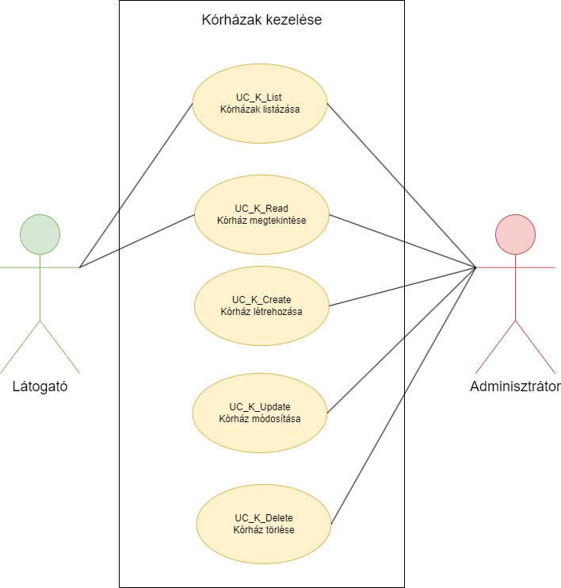
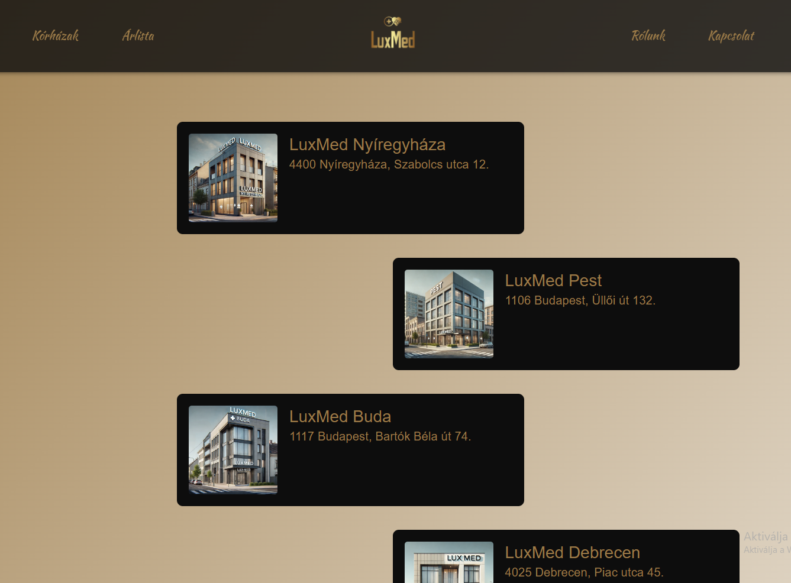
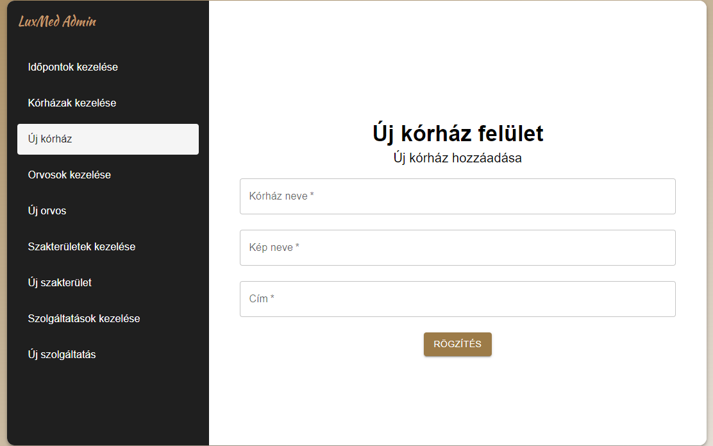
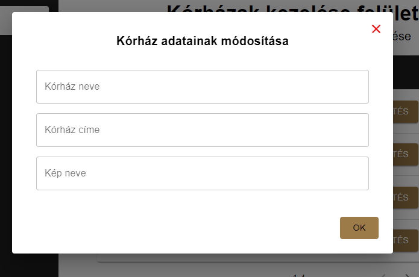
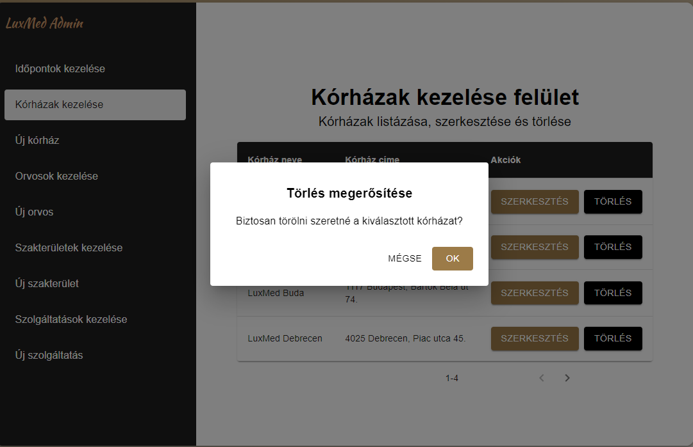

= Kórházak kezelése - Funkcionális modell

== Leírás

A látogató tudja megtekinteni és listázni a rendszerben a kórházakat.

A bejelentkezett adminisztrátor tudja megtekinteni, listázni, módosítani és törölni a rendszerben a kórházakat.
Emellett tudjon új kórházat létrehozni a rendszerben.

== Használati esetek

=== Használati eset diagram

=== Használati esetek rövid leírása

==== Kórházak listázása

[cols="1h,3"]
|===
| Azonosító
| UC_K_List

| Kiváltó esemény
| A látogató listázni kívánja a kórházakat

| Felhasználók
| Látogató, Adminisztrátor

| Elsődleges lefutás
|
1. A látogató a Kórházak menüpontra vagy a főoldalon a Kórházaink gombra kattint

2. A rendszerben kiválogatásra kerülnek a kórházak

| Kivételek és alternatívák
| -

| Utófeltétel
| A rendszerben a kórházak listája előállt

| Eredmény
| A látogató látja a kórházak listáját, kiválaszthat egyet közülük.

| Használati eset realizáció
| Technikai modell

|===

==== Kórház megtekintése

[cols="1h,3"]
|===
| Azonosító
| UC_K_Read

| Kiváltó esemény
| A látogató meg kívánja tekinteni a kiválasztott kórház metaadatait

| Felhasználók
| Látogató, Adminisztrátor

| Elsődleges lefutás
|
1. A látogató a Kórházak oldalon kiválasztja a kórházak listájából a megtekinteni kívánt kórházat

2. A rendszerben lekérdezésre kerül a kiválasztott kórház

| Kivételek és alternatívák
| -

| Utófeltétel
| A rendszerben a kórház lekérdezésre került

| Eredmény
| A látogató látja a kiválasztott kórház metaadatait

| Használati eset realizáció
| Technikai modell

|===

==== Kórház létrehozása

[cols="1h,3"]
|===
| Azonosító
| UC_K_Create

| Kiváltó esemény
| Az adminisztrátor (bejelentkezett felhasználó) új kórházat kíván rögzíteni a rendszerben

| Felhasználók
| Adminisztrátor

| Elsődleges lefutás
|
1. Az adminisztrátor az admin felületen az Új kórház menüpontra kattint

2. Az adminisztrátor az Új kórház felületen megadja a kórház létrehozásához szükséges adatokat

3. A rendszerben rögzítésre kerül az új kórház

| Kivételek és alternatívák
| -

| Utófeltétel
| A rendszerben a kórház rögzítésre került

| Eredmény
| A látogató és az adminisztrátor számára az imént rögzített kórház elérhető a rendszerben

| Használati eset realizáció
| Technikai modell

|===

==== Kórház módosítása

[cols="1h,3"]
|===
| Azonosító
| UC_K_Update

| Kiváltó esemény
| Az adminisztrátor (bejelentkezett felhasználó) módosítani kívánja a kiválasztott kórház metaadatait

| Felhasználók
| Adminisztrátor

| Elsődleges lefutás
|
1. Az adminisztrátor az admin felületen a Kórházak kezelése menüpontra kattint

2. Az adminisztrátor a Kórházak kezelése felületen a módosítani kívánt kórház Szerkesztés gombjára kattintva elindítja a módosítás folyamatát

3. Az adminisztrátor az így megjelenő Kórház adatainak módosítása felületen megadja a módosítani kívánt adatokat

4. A rendszerben a kiválasztott kórház módosításra kerül

| Kivételek és alternatívák
| -

| Utófeltétel
| A rendszerben a kiválasztott kórház módosításra került

| Eredmény
| Az adminisztrátor látja a kórház módosított metaadatait, mely immár a látogató számára is a módosított adatokkal elérhető

| Használati eset realizáció
| Technikai modell

|===

==== Kórház törlése

[cols="1h,3"]
|===
| Azonosító
| UC_K_Delete

| Kiváltó esemény
| Az adminisztrátor (bejelentkezett felhasználó) törölni kívánja a kiválasztott kórházat a rendszerből

| Felhasználók
| Adminisztrátor

| Elsődleges lefutás
|
1. Az adminisztrátor az admin felületen a Kórházak kezelése menüpontra kattint

2. Az adminisztrátor a Kórházak kezelése felületen a törölni kívánt kórház Törlés gombjára kattintva elindítja a törlés folyamatát

3. A felugró párbeszédablak törlés gombjára kattintva a felhasználó megerősíti a törlési szándékát

4. A rendszerben törlésre kerül a kiválasztott kórház

| Kivételek és alternatívák
| -

| Utófeltétel
| A rendszerben a kiválasztott kórház törlésre került

| Eredmény
| A látogató és az adminisztrátor a továbbiakban nem látja a törölt kórház metaadatait

| Használati eset realizáció
| Technikai modell

|===

== Jogosultságok

[cols="1,1,1"]
|===
| Használati eset | Jogosultság | Szerepkörök

| Kórház létrehozása
| CREATE_KORHAZ
| Adminisztrátor

| Kórház módosítása
| UPDATE_KORHAZ
| Adminisztrátor

| Kórház törlése
| DELETE_KORHAZ
| Adminisztrátor

|===

== Felületi terv

=== Kórházak listázása felület

==== Arculat

==== A felületen lévő mezők

[cols="1,1,1,1,1"]

|===
| Név | Típus | Kötelező? | Szerkeszthető? | Megjelenés

| Kórház neve
| Címke
| I
| N
| Találati lista ablakrész

| Kórház képe
| PNG formátumú kép
| I
| N
| Találati lista ablakrész

| Kórház címe
| Címke
| I
| N
| Találati lista ablakrész

|===

==== A felületről elérhető műveletek

[cols="1,1,1"]
|===
| Esemény | Leírás | Jogosultság

| Kiválasztott kórházra kattintás
| Végrehajtásra kerül a Kórház megtekintése használati eset. A képernyőn megjelenik a Kórház oldal a kiválasztott kórház adataival.
| -

|===

=== Kórház megtekintése felület

==== Arculat

image::../static/screenshots/korhaz_megjelenitese.png[Kórház megtekintése]

==== A felületen lévő mezők

[cols="1,1,1,1,1"]

|===
| Név | Típus | Kötelező? | Szerkeszthető? | Megjelenés

| Kórház neve
| Címke
| I
| N
| Kórház neve ablakrész

| Kórház képe
| PNG formátumú kép
| I
| N
| Kórház neve ablakrész

| Szolgáltatásaok
| Címkék (lista)
| I
| N
| Szolgáltatásaink ablakrész

| Orvosok
| Címkék (lista)
| I
| N
| Orvosaink ablakrész

| Kórház címe
| OpenStreetMap Térkép
| I
| N
| Kórházunk elhelyezkedése ablakrész

|===

==== A felületről elérhető műveletek

Nincs elérhető művelet

=== Kórház létrehozása felület

==== Arculat

==== A felületen lévő mezők

[cols="1,1,1,1"]

|===
| Név | Típus | Kötelező? | Szerkeszthető?

| Kórház neve
| Szöveges beviteli mező
| I
| I

| Kép neve
| Szöveges beviteli mező
| I
| I

| Cím
| Szöveges beviteli mező
| I
| I

|===

==== A felületről elérhető műveletek

[cols="1,1,1"]
|===
| Esemény | Leírás | Jogosultság

| Rögzítés gombra kattintás
| Végrehajtásra kerül a Kórház létrehozása használati eset.
| CREATE_KORHAZ

|===

=== Kórház módosítása felület

==== Arculat

==== A felületen lévő mezők

[cols="1,1,1,1"]

|===
| Név | Típus | Kötelező? | Szerkeszthető?

| Kórház neve
| Szöveges beviteli mező
| I
| I

| Kórház címe
| Szöveges beviteli mező
| I
| I

| Kép neve
| Szöveges beviteli mező
| I
| I

|===

==== A felületről elérhető műveletek

[cols="1,1,1"]
|===
| Esemény | Leírás | Jogosultság

| OK gombra kattintás
| Végrehajtásra kerül a Kórház módosítása használati eset. Az adminisztrátor a Kórházak kezelése felületre jut
| UPDATE_KORHAZ

| Piros X gombra kattintás
| Bezáródik a Kórház módosítása felület. Az adminisztrátor a Kórházak kezelése felületre jut
| -

|===

=== Kórház törlése felület

==== Arculat

==== A felületen lévő mezők

|===
| Név | Típus | Kötelező? | Szerkeszthető?

| Kórház neve
| Címke
| I
| N

| Kórház címe
| Címke
| I
| N

|===

==== A felületről elérhető műveletek

[cols="1,1,1"]
|===
| Esemény | Leírás | Jogosultság

| OK gombra kattintás
| Végrehajtásra kerül a Kórház törlése használati eset. Az adminisztrátor a Kórházak kezelése felületre jut
| DELETE_KORHAZ

| Mégse gombra kattintás
| Bezáródik a Kórház törlése felület. Az adminisztrátor a Kórházak kezelése felületre jut
| -

|===

link:../funkcionalis-modellek.adoc[Vissza]
