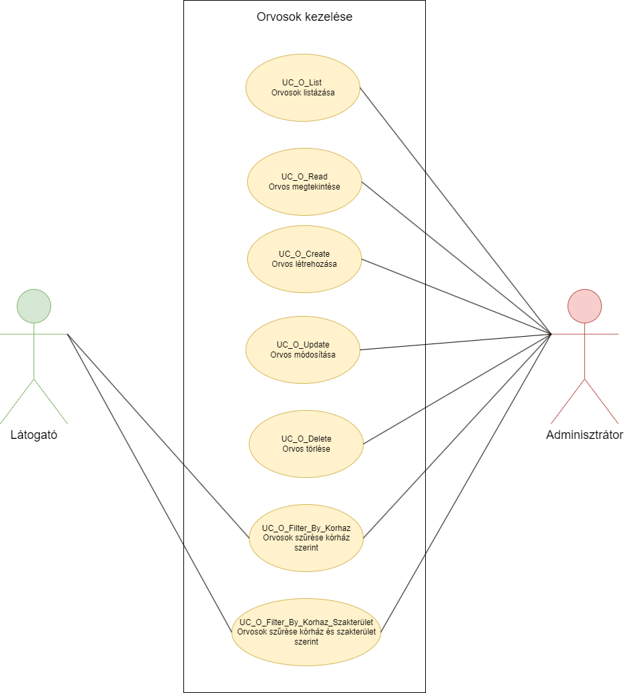
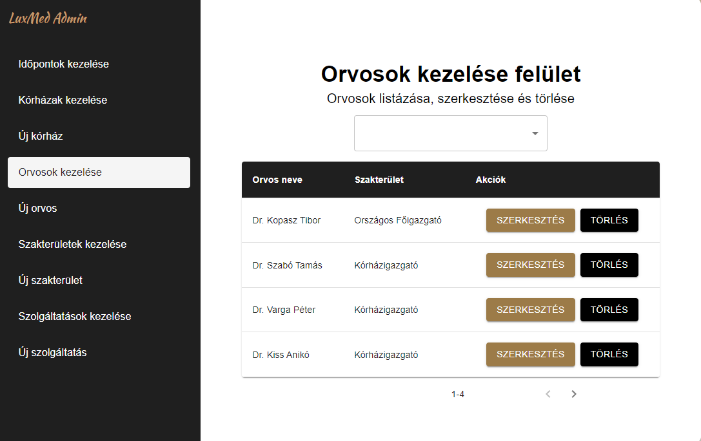
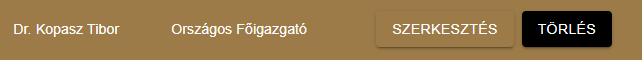
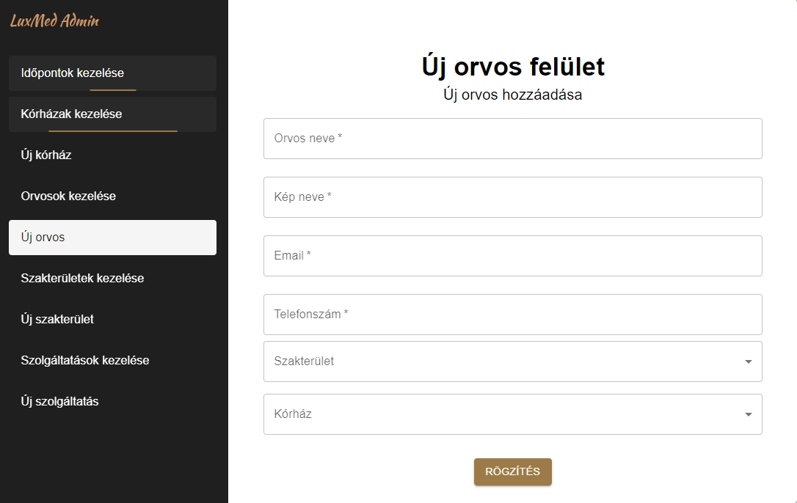
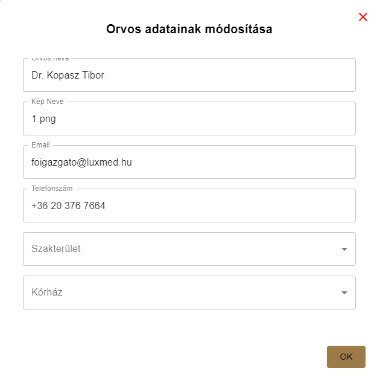
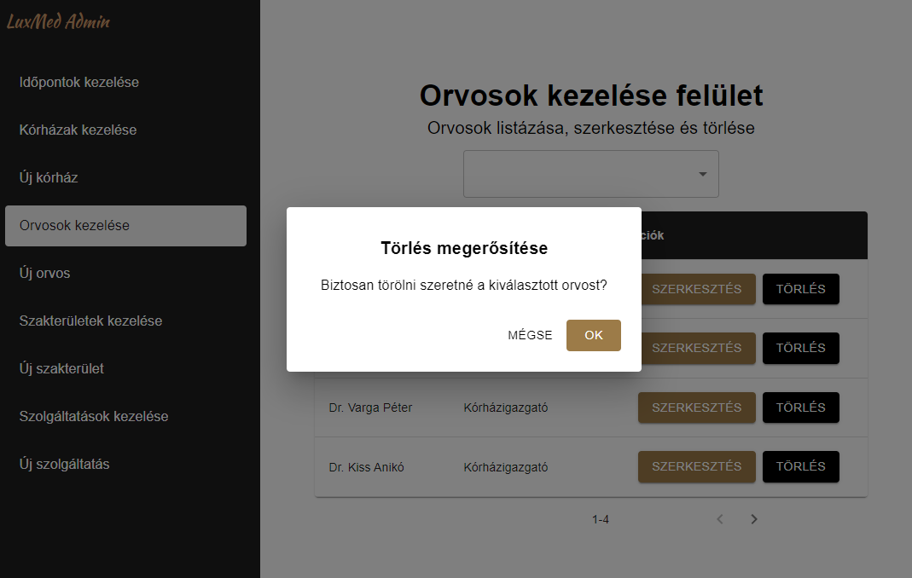
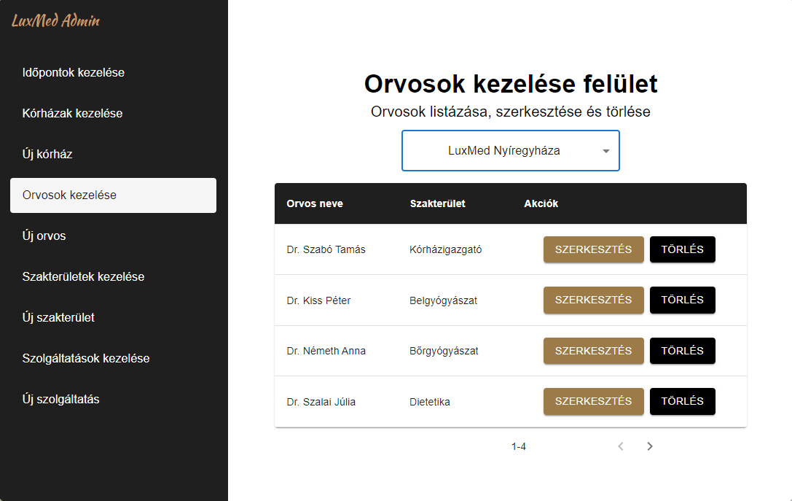

= Orvosok kezelése - Funkcionális modell

== Leírás

A látogató tudja kórház, illetve kórház és szakterület alapján szűrni a rendszerben tárolt orvosokat.

A bejelentkezett adminisztrátor tudja megtekinteni, listázni, módosítani és törölni a rendszerben az orvosokat.
Emellett tudjon új kórházat létrehozni a rendszerben, illetve kórház vagy kórház és szakterület alapján tudja szűrni az orvosokat.

== Használati esetek

=== Használati eset diagram

=== Használati esetek rövid leírása

==== Orvosok listázása

[cols="1h,3"]
|===
| Azonosító
| UC_O_List

| Kiváltó esemény
| Az adminisztrátor (bejelentkezett felhasználó) listázni kívánja az orvosokat

| Felhasználók
| Adminisztrátor

| Elsődleges lefutás
|
1. Az adminisztrátor az admin felületen az Orvosok kezelése menüpontra kattint

2. A rendszerben kiválogatásra kerülnek az orvosok

| Kivételek és alternatívák
| -

| Utófeltétel
| A rendszerben az orvosok listája előállt

| Eredmény
| Az adminisztrátor (bejelentkezett felhasználó) látja az orvosok listáját, kiválaszthat egyet közülük.

| Használati eset realizáció
| link:../technikai-modellek/orvosokKezeleseTechnikaiModell.adoc[Technikai modell]

|===

==== Orvos megtekintése

[cols="1h,3"]
|===
| Azonosító
| UC_O_Read

| Kiváltó esemény
| Az adminisztrátor (bejelentkezett felhasználó) meg kívánja tekinteni a kiválasztott orvos metaadatait

| Felhasználók
| Adminisztrátor

| Elsődleges lefutás
|
1. Az adminisztrátor az admin felületen az orvosok listájából kiválasztja a megtekinteni kívánt orvost

2. A rendszerben lekérdezésre kerül a kiválasztott orvos

| Kivételek és alternatívák
| -

| Utófeltétel
| A rendszerben az orvos lekérdezésre került

| Eredmény
| Az adminisztrátor látja a kiválasztott orvos metaadatait

| Használati eset realizáció
| link:../technikai-modellek/orvosokKezeleseTechnikaiModell.adoc[Technikai modell]

|===

==== Orvos létrehozása

[cols="1h,3"]
|===
| Azonosító
| UC_O_Create

| Kiváltó esemény
| Az adminisztrátor (bejelentkezett felhasználó) új orvost kíván rögzíteni a rendszerben

| Felhasználók
| Adminisztrátor

| Elsődleges lefutás
|
1. Az adminisztrátor az admin felületen az Új orvos menüpontra kattint

2. Az adminisztrátor az Új orvos felületen megadja az orvos rögzítéséhez szükséges adatokat

3. A rendszerben rögzítésre kerül az új orvos

| Kivételek és alternatívák
| -

| Utófeltétel
| A rendszerben az orvos rögzítésre került

| Eredmény
| A látogató és az adminisztrátor számára az imént rögzített orvos elérhető a rendszerben

| Használati eset realizáció
| link:../technikai-modellek/orvosokKezeleseTechnikaiModell.adoc[Technikai modell]

|===

==== Orvos módosítása

[cols="1h,3"]
|===
| Azonosító
| UC_O_Update

| Kiváltó esemény
| Az adminisztrátor (bejelentkezett felhasználó) módosítani kívánja a kiválasztott orvos metaadatait

| Felhasználók
| Adminisztrátor

| Elsődleges lefutás
|
1. Az adminisztrátor az admin felületen az Orvosok kezelése menüpontra kattint

2. Az adminisztrátor az Orvosok kezelése felületen a módosítani kívánt orvos Szerkesztés gombjára kattintva elindítja a módosítás folyamatát

3. Az adminisztrátor az így megjelenő Orvos adatainak módosítása felületen megadja a módosítani kívánt adatokat

4. A rendszerben a kiválasztott orvos módosításra kerül

| Kivételek és alternatívák
| -

| Utófeltétel
| A rendszerben a kiválasztott orvos módosításra került

| Eredmény
| Az adminisztrátor látja a orvos módosított metaadatait, mely immár a látogató számára is a módosított adatokkal elérhető

| Használati eset realizáció
| link:../technikai-modellek/orvosokKezeleseTechnikaiModell.adoc[Technikai modell]

|===

==== Orvos törlése

[cols="1h,3"]
|===
| Azonosító
| UC_O_Delete

| Kiváltó esemény
| Az adminisztrátor (bejelentkezett felhasználó) törölni kívánja a kiválasztott orvost a rendszerből

| Felhasználók
| Adminisztrátor

| Elsődleges lefutás
|
1. Az adminisztrátor az admin felületen az Orvosok kezelése menüpontra kattint

2. Az adminisztrátor az Orvosok kezelése felületen a törölni kívánt orvos Törlés gombjára kattintva elindítja a törlés folyamatát

3. A felugró párbeszédablak törlés gombjára kattintva a felhasználó megerősíti a törlési szándékát

4. A rendszerben törlésre kerül a kiválasztott orvos

| Kivételek és alternatívák
| -

| Utófeltétel
| A rendszerben a kiválasztott orvos törlésre került

| Eredmény
| A látogató és az adminisztrátor a továbbiakban nem látja a törölt orvos metaadatait

| Használati eset realizáció
| link:../technikai-modellek/orvosokKezeleseTechnikaiModell.adoc[Technikai modell]

|===

==== Orvosok szűrése kórház szerint (A: Látogató felület)

[cols="1h,3"]
|===
| Azonosító
| UC_O_Filter_By_Korhaz

| Kiváltó esemény
| A látogató meg kívánja jeleníteni az adott kórházban dolgozó orvosok szűrt listáját.

| Felhasználók
| Látogató, Adminisztrátor

| Elsődleges lefutás
|
1. A látogató a Kórházaink menüpontra kattint

2. A látogató a kórházak így előállt listájából kiválasztja azt a kórházat, amelynek orvosaira kíváncsi

3. A rendszer előállítja a feltételnek megfelelő orvosok listáját

| Kivételek és alternatívák
| -

| Utófeltétel
| A rendszerben a feltételnek megfelelő orvosok listája előállt

| Eredmény
| A látogató látja a feltételnek megfelelő orvosok listáját.

| Használati eset realizáció
| link:../technikai-modellek/orvosokKezeleseTechnikaiModell.adoc[Technikai modell]

|===

==== Orvosok szűrése kórház szerint (B: Admin felület)

[cols="1h,3"]
|===
| Azonosító
| UC_O_Filter_By_Korhaz

| Kiváltó esemény
| Az adminisztrátor (bejelentkezett felhasználó) meg kívánja jeleníteni az adott kórházban dolgozó orvosok szűrt listáját.

| Felhasználók
| Adminisztrátor

| Elsődleges lefutás
|
1. Az adminisztrátor az admin felületen az Orvosok kezelése menüpontra kattint

2. Az így megjelenő Orvosok kezelése komponens tetején az adminisztrátor a legördülő menüből kiválasztja azt a kórházat, amelynek orvosaira kíváncsi

3. A rendszer előállítja a feltételnek megfelelő orvosok listáját

| Kivételek és alternatívák
| -

| Utófeltétel
| A rendszerben a feltételnek megfelelő orvosok listája előállt

| Eredmény
| Az adminisztrátor látja a feltételnek megfelelő orvosok listáját.

| Használati eset realizáció
| link:../technikai-modellek/orvosokKezeleseTechnikaiModell.adoc[Technikai modell]

|===

==== Orvosok szűrése kórház és szakterület szerint

[cols="1h,3"]
|===
| Azonosító
| UC_O_Filter_By_Korhaz_Szakterulet

| Kiváltó esemény
| A látogató meg kívánja jeleníteni az adott kórházban dolgozó, adott szakterületű orvosok szűrt listáját.

| Felhasználók
| Adminisztrátor

| Elsődleges lefutás
|
1. A látogató az Időpontfoglalás gombra kattint

2. A megjelenő kórházak listájából a látogató kiválasztja azt a kórházat, amelynek orvosaira kíváncsi

3. Az ezt követően megjelenő szolgáltatások listájából a látogató kiválasztja azt, amelynek a szakterületén dolgozó orvosokra kíváncsi

4. A rendszer előállítja a feltételnek megfelelő orvosok listáját

| Kivételek és alternatívák
| -

| Utófeltétel
| A rendszerben a feltételnek megfelelő orvosok listája előállt

| Eredmény
| A látogató látja a feltételnek megfelelő orvosok listáját.

| Használati eset realizáció
| link:../technikai-modellek/orvosokKezeleseTechnikaiModell.adoc[Technikai modell]

|===

== Jogosultságok

[cols="1,1,1"]
|===
| Használati eset | Jogosultság | Szerepkörök

| Orvos létrehozása
| CREATE_ORVOS
| Adminisztrátor

| Orvos módosítása
| UPDATE_ORVOS
| Adminisztrátor

| Orvos törlése
| DELETE_ORVOS
| Adminisztrátor

|===

== Felületi terv

=== Orvosok listázása felület

==== Arculat

==== A felületen lévő mezők

[cols="1,1,1,1,1"]

|===
| Név | Típus | Kötelező? | Szerkeszthető? | Megjelenés

| Orvos neve
| Címke
| I
| N
| Találati lista ablakrész

| Szakterület neve
| Címke
| I
| N
| Találati lista ablakrész

|===

==== A felületről elérhető műveletek

[cols="1,1,1"]
|===
| Esemény | Leírás | Jogosultság

| Kiválasztott orvosra kattintás
| Végrehajtásra kerül az Orvos megtekintése használati eset. Az adminisztrátor az Orvos megtekintése felületre jut.
| -

| Szerkesztés gombra kattintás
| Végrehajtásra kerül az Orvos módosítása használati eset. Az adminisztrátor az Orvos módosítása felületre jut.
| -

| Törlés gombra kattintás
| Végrehajtásra kerül az Orvos törlése használati eset. Az adminisztrátor az Orvos törlése felületre jut.
| -

| Legördülő menüben kórház kiválasztása
| Végrehajtásra kerül az Orvos szűrése kórház szerint (B: Admin felület) használati eset. Az adminisztrátor az Orvos szűrése kórház szerint (B: Admin felület) felületre jut.
| -

|===

=== Orvos megtekintése felület

==== Arculat

==== A felületen lévő mezők

[cols="1,1,1,1,1"]

|===
| Név | Típus | Kötelező? | Szerkeszthető? | Megjelenés

| Orvos neve
| Címke
| I
| N
| Találati lista ablakrész

| Szakterület neve
| Címke
| I
| N
| Találati lista ablakrész

|===

==== A felületről elérhető műveletek

[cols="1,1,1"]
|===
| Esemény | Leírás | Jogosultság

| Szerkesztés gombra kattintás
| Végrehajtásra kerül az Orvos módosítása használati eset. Az adminisztrátor az Orvos módosítása felületre jut.
| -

| Törlés gombra kattintás
| Végrehajtásra kerül az Orvos törlése használati eset. Az adminisztrátor az Orvos törlése felületre jut.
| -

|===

=== Orvos létrehozása felület

==== Arculat

==== A felületen lévő mezők

[cols="1,1,1,1"]

|===
| Név | Típus | Kötelező? | Szerkeszthető?

| Orvos neve
| Szöveges beviteli mező
| I
| I

| Kép neve
| Szöveges beviteli mező
| I
| I

| Email
| Szöveges beviteli mező
| I
| I

| Telefonszám
| Szöveges beviteli mező
| I
| I

| Szakterület
| Legördülő menü
| I
| I

| Kórház
| Legördülő menü
| I
| I

|===

==== A felületről elérhető műveletek

[cols="1,1,1"]
|===
| Esemény | Leírás | Jogosultság

| Rögzítés gombra kattintás
| Végrehajtásra kerül az Orvos létrehozása használati eset.
| CREATE_ORVOS

|===

=== Orvos módosítása felület

==== Arculat

==== A felületen lévő mezők

[cols="1,1,1,1"]

|===
| Név | Típus | Kötelező? | Szerkeszthető?

| Orvos neve
| Szöveges beviteli mező
| I
| I

| Kép neve
| Szöveges beviteli mező
| I
| I

| Email
| Szöveges beviteli mező
| I
| I

| Telefonszám
| Szöveges beviteli mező
| I
| I

| Szakterület
| Legördülő menü
| I
| I

| Kórház
| Legördülő menü
| I
| I

|===

==== A felületről elérhető műveletek

[cols="1,1,1"]
|===
| Esemény | Leírás | Jogosultság

| OK gombra kattintás
| Végrehajtásra kerül az Orvos módosítása használati eset. Az adminisztrátor az Orvosok kezelése felületre jut
| UPDATE_ORVOS

| Piros X gombra kattintás
| Bezáródik az Orvos módosítása felület. Az adminisztrátor az Orvosok kezelése felületre jut
| -

|===

=== Orvos törlése felület

==== Arculat

==== A felületen lévő mezők

|===
| Név | Típus | Kötelező? | Szerkeszthető?

| Orvos neve
| Címke
| I
| N

| Szakterület neve
| Címke
| I
| N

|===

==== A felületről elérhető műveletek

[cols="1,1,1"]
|===
| Esemény | Leírás | Jogosultság

| OK gombra kattintás
| Végrehajtásra kerül az Orvos törlése használati eset. Az adminisztrátor az Orvosok kezelése felületre jut
| DELETE_ORVOS

| Mégse gombra kattintás
| Bezáródik az Orvos törlése felület. Az adminisztrátor az Orvosok kezelése felületre jut
| -

|===

=== Orvosok szűrése kórház szerint (A: Látogató felület)

==== Arculat

==== A felületen lévő mezők

|===
| Név | Típus | Kötelező? | Szerkeszthető?

| Orvos neve
| Címke
| I
| N

| Szakterület neve
| Címke
| I
| N

| Telefonszám
| Címke
| I
| N

| E-mail
| Címke
| I
| N

|===

==== A felületről elérhető műveletek
Nincsenek elérhető műveletek

=== Orvosok szűrése kórház szerint (B: Admin felület)

==== Arculat

==== A felületen lévő mezők

|===
| Név | Típus | Kötelező? | Szerkeszthető?

| Orvos neve
| Címke
| I
| N

| Szakterület neve
| Címke
| I
| N

|===

==== A felületről elérhető műveletek

[cols="1,1,1"]
|===
| Esemény | Leírás | Jogosultság

| Kiválasztott orvosra kattintás
| Végrehajtásra kerül az Orvos megtekintése használati eset. Az adminisztrátor az Orvos megtekintése felületre jut.
| -

| Szerkesztés gombra kattintás
| Végrehajtásra kerül az Orvos módosítása használati eset. Az adminisztrátor az Orvos módosítása felületre jut.
| -

| Törlés gombra kattintás
| Végrehajtásra kerül az Orvos törlése használati eset. Az adminisztrátor az Orvos törlése felületre jut.
| -

| Legördülő menüben kórház kiválasztása
| Végrehajtásra kerül az Orvos szűrése kórház szerint (B: Admin felület) használati eset. Az adminisztrátor az Orvos szűrése kórház szerint (B: Admin felület) felületre jut.
| -

|===

=== Orvosok szűrése kórház és szakterület szerint

==== Arculat

==== A felületen lévő mezők

|===
| Név | Típus | Kötelező? | Szerkeszthető?

| Orvos neve
| Címke
| I
| N

|===

==== A felületről elérhető műveletek

[cols="1,1,1"]
|===
| Esemény | Leírás | Jogosultság

| Orvos nevére kattintás
| Az időpontfoglalás során a látogató az imént kiválasztott orvoshoz foglal időpontot
| -

|===

link:../funkcionalis-modellek.adoc[Vissza]