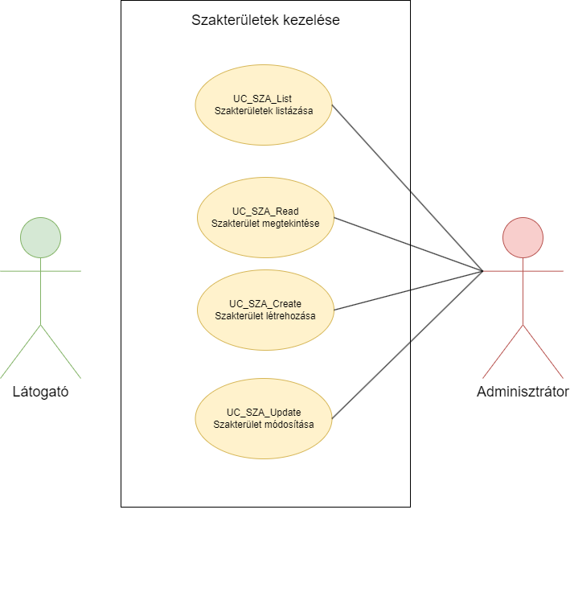
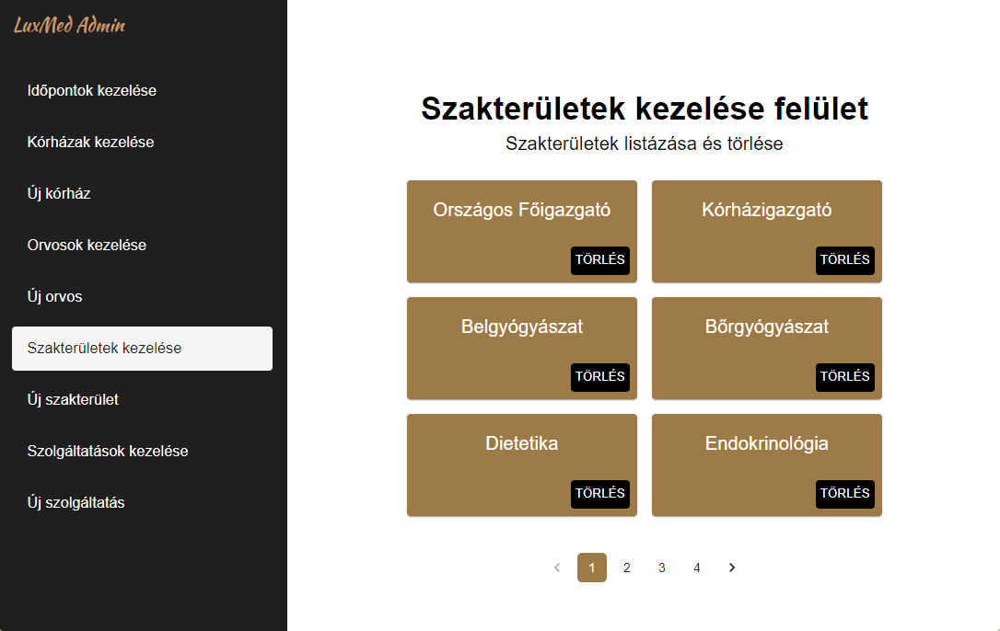
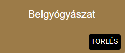
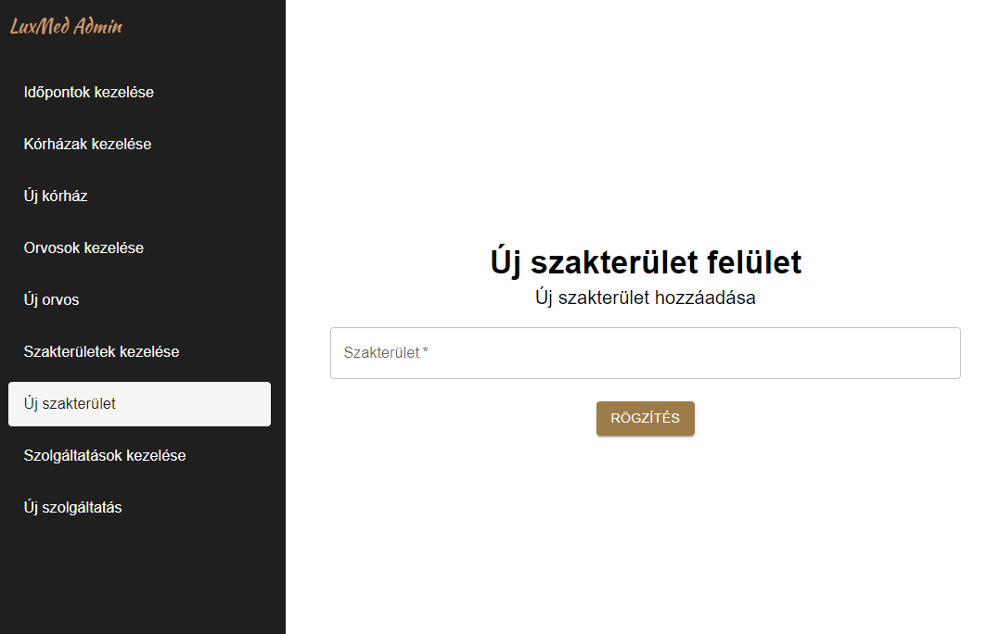
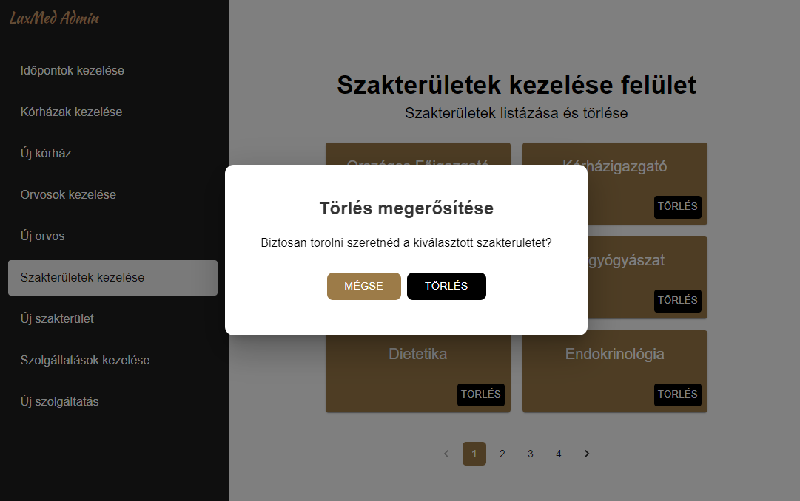

= Szakterületek kezelése - Funkcionális modell

== Leírás
A bejelentkezett adminisztrátor tudja megtekinteni, listázni, és törölni a rendszerben a szakterületeket.
Emellett tudjon új szakterületet létrehozni a rendszerben.

== Használati esetek

=== Használati eset diagram

=== Használati esetek rövid leírása

==== Szakterületek listázása

[cols="1h,3"]
|===
| Azonosító
| UC_SZA_List

| Kiváltó esemény
| Az adminisztrátor (bejelentkezett felhasználó) listázni kívánja a szakterületeket

| Felhasználók
| Adminisztrátor

| Elsődleges lefutás
|
1. Az adminisztrátor az admin felületen a Szakterületek kezelése menüpontra kattint

2. A rendszerben kiválogatásra kerülnek a szakterületek

| Kivételek és alternatívák
| -

| Utófeltétel
| A rendszerben a szakterületek listája előállt

| Eredmény
| Az adminisztrátor (bejelentkezett felhasználó) látja a szakterületek listáját, kiválaszthat egyet közülük.

| Használati eset realizáció
| Technikai modell

|===

==== Szakterület megtekintése

[cols="1h,3"]
|===
| Azonosító
| UC_SZA_Read

| Kiváltó esemény
| Az adminisztrátor (bejelentkezett felhasználó) meg kívánja tekinteni a kiválasztott szakterület metaadatait

| Felhasználók
| Adminisztrátor

| Elsődleges lefutás
|
1. Az adminisztrátor az admin felületen a szakterületek listájából kiválasztja a megtekinteni kívánt szakterületet

2. A rendszerben lekérdezésre kerül a kiválasztott szakterület

| Kivételek és alternatívák
| -

| Utófeltétel
| A rendszerben a szakterület lekérdezésre került

| Eredmény
| Az adminisztrátor látja a kiválasztott szakterület metaadatait

| Használati eset realizáció
| Technikai modell

|===

==== Szakterület létrehozása

[cols="1h,3"]
|===
| Azonosító
| UC_SZA_Create

| Kiváltó esemény
| Az adminisztrátor (bejelentkezett felhasználó) új szakterületet kíván rögzíteni a rendszerben

| Felhasználók
| Adminisztrátor

| Elsődleges lefutás
|
1. Az adminisztrátor az admin felületen az Új szakterület menüpontra kattint

2. Az adminisztrátor az Új szakterület felületen megadja a szakterület létrehozásához szükséges adatokat

3. A rendszerben rögzítésre kerül az új szakterület

| Kivételek és alternatívák
| -

| Utófeltétel
| A rendszerben a szakterület rögzítésre került

| Eredmény
| A látogató és az adminisztrátor számára az imént rögzített szakterület elérhető a rendszerben

| Használati eset realizáció
| Technikai modell

|===

==== Szakterület törlése

[cols="1h,3"]
|===
| Azonosító
| UC_SZA_Delete

| Kiváltó esemény
| Az adminisztrátor (bejelentkezett felhasználó) törölni kívánja a kiválasztott szakterületet a rendszerből

| Felhasználók
| Adminisztrátor

| Elsődleges lefutás
|
1. Az adminisztrátor az admin felületen a Szakterületek kezelése menüpontra kattint

2. Az adminisztrátor a Szakterületek kezelése felületen a törölni kívánt szakterület Törlés gombjára kattintva elindítja a törlés folyamatát

3. A felugró párbeszédablak törlés gombjára kattintva a felhasználó megerősíti a törlési szándékát

4. A rendszerben törlésre kerül a kiválasztott szakterület

| Kivételek és alternatívák
| -

| Utófeltétel
| A rendszerben a kiválasztott szakterület törlésre került

| Eredmény
| A látogató és az adminisztrátor a továbbiakban nem látja a törölt szakterület metaadatait

| Használati eset realizáció
| Technikai modell

|===

== Jogosultságok

[cols="1,1,1"]
|===
| Használati eset | Jogosultság | Szerepkörök

| Szakterület létrehozása
| CREATE_SZAKTERULET
| Adminisztrátor

| Szakterület törlése
| DELETE_SZOLGALTATAS
| Adminisztrátor

|===

== Felületi terv

=== Szakterületek listázása felület

==== Arculat

==== A felületen lévő mezők

[cols="1,1,1,1,1"]

|===
| Név | Típus | Kötelező? | Szerkeszthető? | Megjelenés

| Szakterület neve
| Címke
| I
| N
| Találati lista ablakrész

|===

==== A felületről elérhető műveletek

[cols="1,1,1"]
|===
| Esemény | Leírás | Jogosultság

| Kiválasztott szakterületre kattintás
| Végrehajtásra kerül a Szakterület megtekintése használati eset.
| -

|===

=== Szakterület megtekintése felület

==== Arculat

==== A felületen lévő mezők

[cols="1,1,1,1,1"]

|===
| Név | Típus | Kötelező? | Szerkeszthető? | Megjelenés

| Szakterület neve
| Címke
| I
| N
| Találati lista ablakrész

|===

==== A felületről elérhető műveletek

[cols="1,1,1"]
|===
| Esemény | Leírás | Jogosultság

| Törlés gombra kattintás
| Végrehajtásra kerül a Szakterület törlése használati eset.
| -

|===

=== Szakterület létrehozása felület

==== Arculat

==== A felületen lévő mezők

[cols="1,1,1,1,1"]

|===
| Név | Típus | Kötelező? | Szerkeszthető? | Megjelenés

| Szakterület neve
| Szöveges beviteli mező
| I
| I
| Űrlap ablakrész

|===

==== A felületről elérhető műveletek

[cols="1,1,1"]
|===
| Esemény | Leírás | Jogosultság

| Rögzítés gombra kattintás
| Végrehajtásra kerül a Szakterület létrehozása használati eset.
| CREATE_SZAKTERULET

|===

=== Szakterület törlése felület

==== Arculat

==== A felületen lévő mezők

[cols="1,1,1,1,1"]

|===
| Név | Típus | Kötelező? | Szerkeszthető? | Megjelenés

| Szakterület neve
| Címke
| I
| N
| Találati lista ablakrész

|===

==== A felületről elérhető műveletek

[cols="1,1,1"]
|===
| Esemény | Leírás | Jogosultság

| Mégse gombra kattintás
| Bezáródik a Szakterület törlése felület. Az adminisztátor a Szakterületek kezelése felületre jut.
| -

| Törlés gombra kattintás
| Végrehajtásra kerül a Szakterület törlése használati eset. Az adminisztátor a Szakterületek kezelése felületre jut.
| -

|===

link:../funkcionalis-modellek.adoc[Vissza]