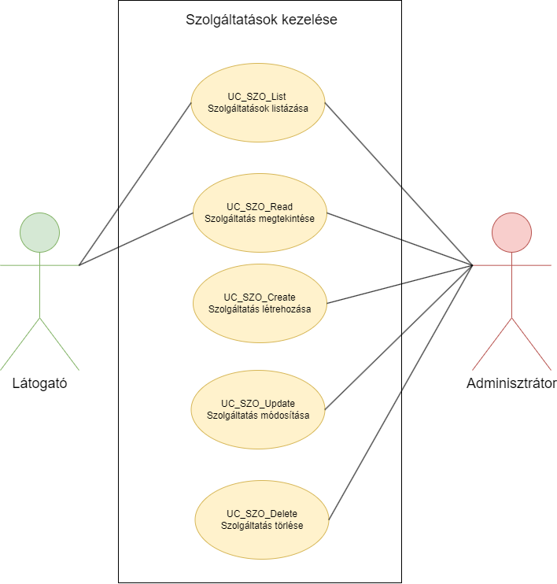
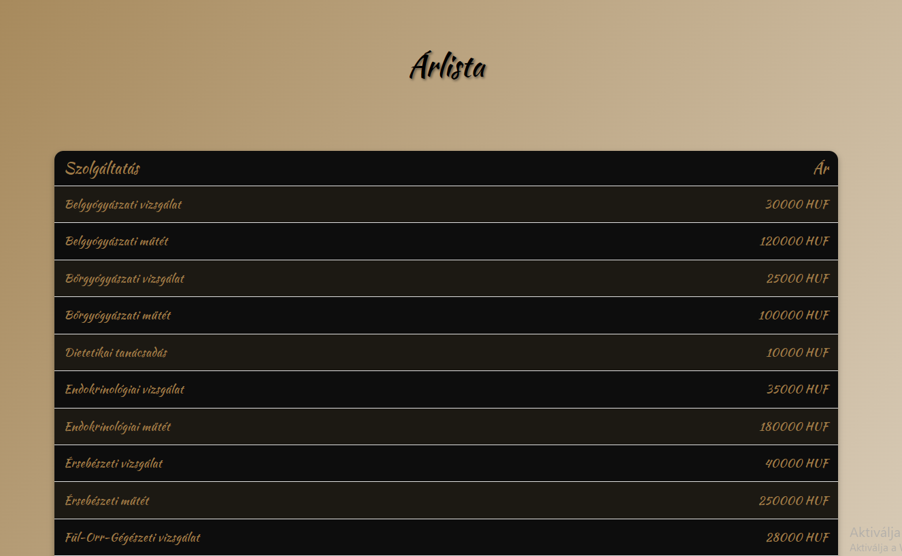
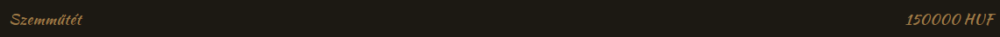
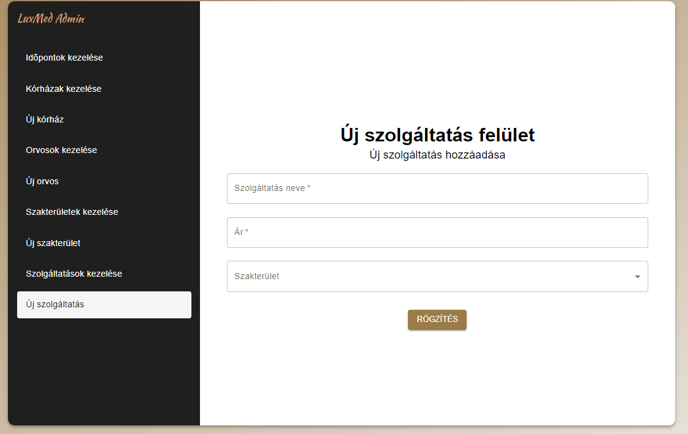
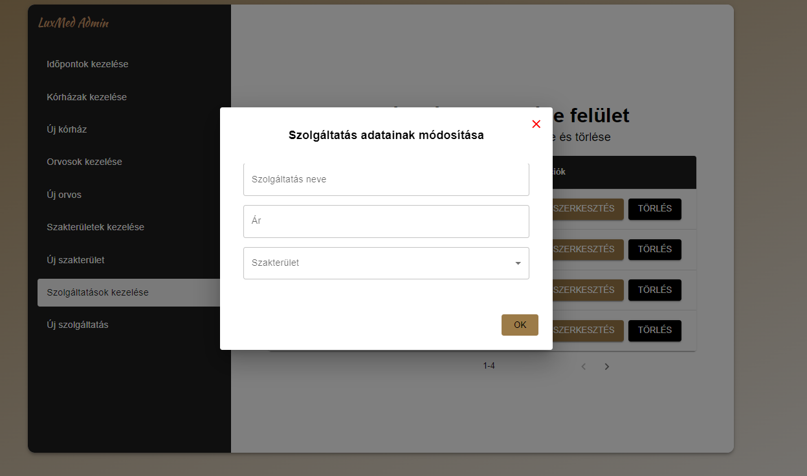
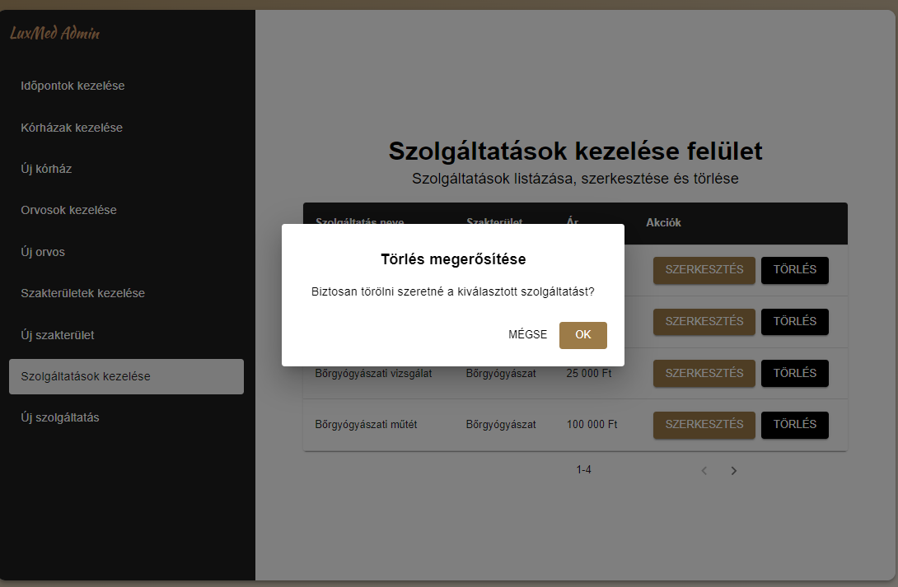

= Szolgáltatások kezelése - Funkcionális modell

== Leírás
A látogató tudja megtekinteni és listázni a rendszerben a szolgáltatásokat.

A bejelentkezett adminisztrátor tudja megtekinteni, listázni, módosítani és törölni a rendszerben a szolgáltatásokat.
Emellett tudjon új szolgáltatást létrehozni a rendszerben.

== Használati esetek

=== Használati eset diagram

=== Használati esetek rövid leírása

==== Szolgáltatások listázása

[cols="1h,3"]
|===
| Azonosító
| UC_SZO_List

| Kiváltó esemény
| A látogató listázni kívánja a szolgáltatásokat

| Felhasználók
| Látogató, Adminisztrátor

| Elsődleges lefutás
|
1. A látogató az Árlista menüpontra vagy a főoldalon a Szolgáltatásaink gombra kattint

2. A rendszerben kiválogatásra kerülnek a szolgáltatások

| Kivételek és alternatívák
| -

| Utófeltétel
| A rendszerben a szolgáltatások listája előállt

| Eredmény
| A látogató látja a szolgáltatások listáját, kiválaszthat egyet közülük.

| Használati eset realizáció
| Technikai modell

|===

==== Szolgáltatás megtekintése

[cols="1h,3"]
|===
| Azonosító
| UC_SZO_Read

| Kiváltó esemény
| A látogató meg kívánja tekinteni a kiválasztott szolgáltatás metaadatait

| Felhasználók
| Látogató, Adminisztrátor

| Elsődleges lefutás
|
1. A látogató az Árlista oldalon kiválasztja a szolgáltatások listájából a megtekinteni kívánt szolgáltatást

2. A rendszerben lekérdezésre kerül a kiválasztott szolgáltatás

| Kivételek és alternatívák
| -

| Utófeltétel
| A rendszerben a szolgáltatás lekérdezésre került

| Eredmény
| A látogató látja a kiválasztott szolgáltatás metaadatait

| Használati eset realizáció
| Technikai modell

|===

==== Szolgáltatás létrehozása

[cols="1h,3"]
|===
| Azonosító
| UC_SZO_Create

| Kiváltó esemény
| Az adminisztrátor (bejelentkezett felhasználó) új szolgáltatást kíván rögzíteni a rendszerben

| Felhasználók
| Adminisztrátor

| Elsődleges lefutás
|
1. Az adminisztrátor az admin felületen az Új szolgáltatás menüpontra kattint

2. Az adminisztrátor az Új szolgáltatás felületen megadja a szolgáltatás létrehozásához szükséges adatokat

3. A rendszerben rögzítésre kerül az új szolgáltatás

| Kivételek és alternatívák
| -

| Utófeltétel
| A rendszerben a szolgáltatás rögzítésre került

| Eredmény
| A látogató és az adminisztrátor számára az imént rögzített szolgáltatás elérhető a rendszerben

| Használati eset realizáció
| Technikai modell

|===

==== Szolgáltatás módosítása

[cols="1h,3"]
|===
| Azonosító
| UC_SZO_Update

| Kiváltó esemény
| Az adminisztrátor (bejelentkezett felhasználó) módosítani kívánja a kiválasztott szolgáltatás metaadatait

| Felhasználók
| Adminisztrátor

| Elsődleges lefutás
|
1. Az adminisztrátor az admin felületen a Szolgáltatások kezelése menüpontra kattint

2. Az adminisztrátor a Szolgáltatások kezelése felületen a módosítani kívánt szolgáltatás Szerkesztés gombjára kattintva elindítja a módosítás folyamatát

3. Az adminisztrátor az így megjelenő Szolgáltatás adatainak módosítása felületen megadja a módosítani kívánt adatokat

4. A rendszerben a kiválasztott szolgáltatás módosításra kerül

| Kivételek és alternatívák
| -

| Utófeltétel
| A rendszerben a kiválasztott szolgáltatás módosításra került

| Eredmény
| Az adminisztrátor látja a szolgáltatás módosított metaadatait, mely immár a látogató számára is a módosított adatokkal elérhető

| Használati eset realizáció
| Technikai modell

|===

==== Szolgáltatás törlése

[cols="1h,3"]
|===
| Azonosító
| UC_SZO_Delete

| Kiváltó esemény
| Az adminisztrátor (bejelentkezett felhasználó) törölni kívánja a kiválasztott szolgáltatást a rendszerből

| Felhasználók
| Adminisztrátor

| Elsődleges lefutás
|
1. Az adminisztrátor az admin felületen a Szolgáltatások kezelése menüpontra kattint

2. Az adminisztrátor a Szolgáltatások kezelése felületen a törölni kívánt szolgáltatás Törlés gombjára kattintva elindítja a törlés folyamatát

3. A felugró párbeszédablak törlés gombjára kattintva a felhasználó megerősíti a törlési szándékát

4. A rendszerben törlésre kerül a kiválasztott szolgáltatás

| Kivételek és alternatívák
| -

| Utófeltétel
| A rendszerben a kiválasztott szolgáltatás törlésre került

| Eredmény
| A látogató és az adminisztrátor a továbbiakban nem látja a törölt szolgáltatás metaadatait

| Használati eset realizáció
| Technikai modell

|===

== Jogosultságok

[cols="1,1,1"]
|===
| Használati eset | Jogosultság | Szerepkörök

| Szolgáltatás létrehozása
| CREATE_SZOLGALTATAS
| Adminisztrátor

| Szolgáltatás módosítása
| UPDATE_SZOLGALTATAS
| Adminisztrátor

| Szolgáltatás törlése
| DELETE_SZOLGALTATAS
| Adminisztrátor

|===

== Felületi terv

=== Szolgáltatások listázása felület

==== Arculat

==== A felületen lévő mezők

[cols="1,1,1,1,1"]

|===
| Név | Típus | Kötelező? | Szerkeszthető? | Megjelenés

| Szolgáltatás neve
| Címke
| I
| N
| Találati lista ablakrész

| Szolgáltatás ára címe
| Címke
| I
| N
| Találati lista ablakrész

|===

==== A felületről elérhető műveletek

[cols="1,1,1"]
|===
| Esemény | Leírás | Jogosultság

| Kiválasztott szolgáltatásra kattintás
| Végrehajtásra kerül a Szolgáltatás megtekintése használati eset.
| -

|===

=== Szolgáltatás megtekintése felület

==== Arculat

==== A felületen lévő mezők

[cols="1,1,1,1,1"]

|===
| Név | Típus | Kötelező? | Szerkeszthető? | Megjelenés

| Szolgáltatás neve
| Címke
| I
| N
| Találati lista ablakrész

| Szolgáltatás ára címe
| Címke
| I
| N
| Találati lista ablakrész

|===

==== A felületről indítható műveletek
Nincs elérhető művelet

=== Szolgáltatás létrehozása felület

==== Arculat

==== A felületen lévő mezők

[cols="1,1,1,1"]

|===
| Név | Típus | Kötelező? | Szerkeszthető?

| Szolgáltatás neve
| Szöveges beviteli mező
| I
| I

| Ár
| Szöveges beviteli mező
| I
| I

| Szakterület
| Legördülő menü
| I
| I

|===

==== A felületről elérhető műveletek

[cols="1,1,1"]
|===
| Esemény | Leírás | Jogosultság

| Rögzítés gombra kattintás
| Végrehajtásra kerül a Szolgáltatás létrehozása használati eset.
| CREATE_SZOLGALTATAS

|===

=== Szolgáltatás módosítása felület

==== Arculat

==== A felületen lévő mezők

[cols="1,1,1,1"]

|===
| Név | Típus | Kötelező? | Szerkeszthető?

| Szolgáltatás neve
| Szöveges beviteli mező
| I
| I

| Ár
| Szöveges beviteli mező
| I
| I

| Szakterület
| Legördülő menü
| I
| I

|===

==== A felületről elérhető műveletek

[cols="1,1,1"]
|===
| Esemény | Leírás | Jogosultság

| OK gombra kattintás
| Végrehajtásra kerül a Szolgáltatás módosítása használati eset. Az adminisztrátor a Szolgáltatások kezelése felületre jut.
| UPDATE_SZOLGALTATAS

| Piros X gombra kattintás
| Bezáródik a Szolgáltatás módosítása felület. Az adminisztrátor a Szolgáltatások kezelése felületre jut
| -

|===

=== Szolgáltatás törlése felület

==== Arculat

==== A felületen lévő mezők

|===
| Név | Típus | Kötelező? | Szerkeszthető?

| Szolgáltatás neve
| Címke
| I
| N

| Szakterület
| Címke
| I
| N

| Ár
| Címke
| I
| N

|===

==== A felületről elérhető műveletek

[cols="1,1,1"]
|===
| Esemény | Leírás | Jogosultság

| OK gombra kattintás
| Végrehajtásra kerül a Szolgáltatás törlése használati eset. Az adminisztrátor a Szolgáltatások kezelése felületre jut
| DELETE_SZOLGALTATAS

| Mégse gombra kattintás
| Bezáródik a Szolgáltatás törlése felület. Az adminisztrátor a Szolgáltatások kezelése felületre jut
| -

|===

link:../funkcionalis-modellek.adoc[Vissza]